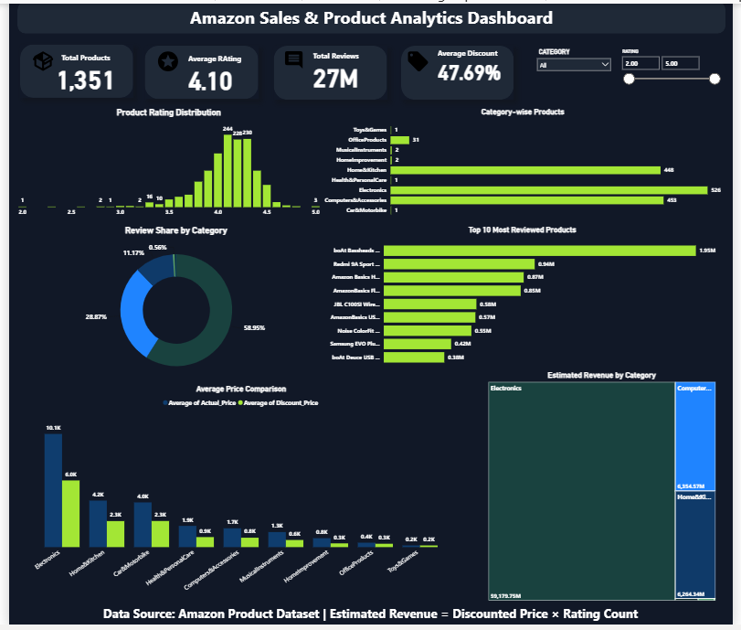

# Amazon Product Analytics Pipeline

## Project Overview

This project demonstrates an end-to-end cloud-based product analytics pipeline using **AWS S3, Snowflake, SQL, and Power BI**.

The Amazon Product dataset is stored in AWS S3, integrated with Snowflake using Storage Integration and an External Stage, loaded into Snowflake for SQL-based analysis, and connected to Power BI to build an interactive product analytics dashboard.

The project analyzes **1,351 Amazon products** across product categories, ratings, customer reviews, pricing, and discounts to generate actionable business insights.

---

## Business Problem

E-commerce platforms contain large volumes of product data across multiple categories, making it difficult to manually evaluate product performance, customer engagement, pricing, and discount strategies.

The objective of this project is to build an end-to-end analytics pipeline that centralizes Amazon product data in a cloud data warehouse and enables business users to analyze product performance through SQL and an interactive Power BI dashboard.

### Business Questions

The analysis aims to answer:

- Which product categories receive the highest customer engagement?
- Which categories contain the largest number of products?
- Which products receive the most customer reviews?
- How are product ratings distributed?
- How do actual and discounted prices compare across categories?
- Which categories offer the highest discounts?
- Do higher discounts necessarily correspond to higher ratings?
- Which categories show the highest estimated revenue potential?

---

## Architecture

The project follows a cloud-based analytics workflow where raw product data is stored in AWS S3, ingested into Snowflake, analyzed using SQL, and visualized using Power BI.

```text
Amazon Product Dataset (CSV)
            │
            ▼
         AWS S3
            │
            ▼
Snowflake Storage Integration
            │
            ▼
  Snowflake External Stage
            │
            ▼
     Snowflake Table
            │
            ▼
       SQL Analysis
            │
            ▼
    Power BI Dashboard
```

### Data Flow

1. **Data Storage** — The Amazon product dataset is stored as a CSV file in AWS S3.
2. **Cloud Integration** — Snowflake Storage Integration provides access between Snowflake and AWS S3.
3. **External Stage** — A Snowflake External Stage references the dataset stored in S3.
4. **Data Loading** — Product data is loaded into a Snowflake table for analytical querying.
5. **SQL Analysis** — SQL is used to analyze products, categories, ratings, and discounts.
6. **Visualization** — The analytical dataset is connected to Power BI for interactive reporting.

---

## Tech Stack

| Technology | Purpose |
|---|---|
| AWS S3 | Cloud storage for the source dataset |
| AWS IAM | Access management for AWS resources |
| Snowflake | Cloud data warehouse |
| SQL | Data querying and analytical calculations |
| Power BI | Dashboard development and business reporting |

---

## Dataset Information

The dataset contains **1,351 Amazon products** with information related to products, categories, customer ratings, reviews, prices, and discounts.

### Dataset Fields

| Column | Description |
|---|---|
| product_id | Unique product identifier |
| product_name | Product name |
| category | Product category |
| discounted_price | Product price after discount |
| actual_price | Original product price |
| discount_percentage | Discount applied to the product |
| rating | Average product rating |
| rating_count | Number of customer ratings |
| about_product | Product description |
| user_id | Customer/user identifier |
| user_name | Customer/user name |
| review_id | Review identifier |
| review_title | Review title |
| review_content | Customer review content |
| img_link | Product image URL |
| product_link | Amazon product URL |

**Total Products Analyzed:** 1,351

---

## SQL Analysis

SQL queries were used to explore product performance and generate analytical outputs from the Snowflake dataset.

### Analysis Performed

- Total number of unique products
- Average product rating
- Top 10 highest-rated products
- Category-wise product count
- Top products by discount percentage

### Example SQL

```sql
-- Total Products
SELECT COUNT(DISTINCT product_id) AS total_products
FROM amazon_sales;

-- Average Rating
SELECT AVG(TRY_CAST(rating AS FLOAT)) AS avg_rating
FROM amazon_sales;

-- Top 10 Highest Rated Products
SELECT product_name, rating
FROM amazon_sales
ORDER BY rating DESC
LIMIT 10;

-- Category-wise Product Count
SELECT category, COUNT(*) AS total_products
FROM amazon_sales
GROUP BY category
ORDER BY total_products DESC;

-- Highest Discount Products
SELECT product_name, discount_percentage
FROM amazon_sales
ORDER BY discount_percentage DESC
LIMIT 10;
```

The complete SQL script is available in the `SQL` directory.

---

## Power BI Dashboard

An interactive Power BI dashboard was developed to provide a consolidated view of Amazon product performance.

### KPI Cards

| KPI | Dashboard Result |
|---|---:|
| Total Products | 1,351 |
| Average Rating | 4.10 |
| Total Reviews | 27M |
| Average Discount | 47.69% |

### Dashboard Visualizations

The dashboard includes:

- Product Rating Distribution
- Category-wise Product Count
- Review Share by Category
- Top 10 Most Reviewed Products
- Average Actual Price vs. Average Discounted Price
- Estimated Revenue by Category
- Category filter
- Rating range filter

### Estimated Revenue

For analytical purposes, estimated revenue is calculated using:

```text
Estimated Revenue = Discounted Price × Rating Count
```

This is an analytical estimate based on the available dataset and should not be interpreted as actual Amazon sales revenue.

---

## Dashboard Preview



---

## Key Insights

### Product Ratings

- The overall average product rating is approximately **4.10**.
- The rating distribution is concentrated around the 4-star range, indicating generally positive customer feedback.

### Customer Engagement

- The dataset contains approximately **27 million ratings/reviews** based on the dashboard aggregation.
- Electronics-related products account for a substantial share of customer engagement.

### Discounts

- The average discount across products is approximately **47.69%**.
- Some products and categories offer discounts above 50%.
- Higher discounts do not necessarily correspond to higher product ratings.

### Category Performance

- Electronics represents one of the largest product categories in the dataset.
- Home & Kitchen and Computer & Accessories also contribute significantly to the product portfolio.

### Pricing

- The comparison between actual and discounted prices highlights substantial price reductions across several categories.
- Electronics shows a particularly large difference between average actual and discounted prices.

---

## Business Recommendations

Based on the analysis:

1. **Prioritize high-engagement categories**  
   Categories generating large review volumes can be prioritized for product assortment, marketing, and customer engagement initiatives.

2. **Evaluate discount effectiveness**  
   Since large discounts do not automatically produce higher ratings, discount strategies should be evaluated alongside customer satisfaction and product quality.

3. **Monitor highly reviewed products**  
   Products receiving significant review activity can be monitored as indicators of strong customer interest.

4. **Optimize category-level pricing**  
   Large differences between actual and discounted prices should be evaluated to determine whether discount levels are commercially sustainable.

5. **Use ratings alongside engagement metrics**  
   Product ratings should not be evaluated in isolation. Combining ratings with rating counts provides a stronger view of product performance.

---

## Project Structure

```text
amazon-product-analytics-pipeline/
│
├── Data/
│   └── Amazon product dataset
│
├── SQL/
│   └── snowflake_queries.sql
│
├── Dashboard/
│   └── Power BI dashboard (.pbix)
│
├── Screenshots/
│   └── dashboard.png
│
└── README.md
```

---

## How to Reproduce the Project

1. Upload the Amazon product CSV dataset to an AWS S3 bucket.
2. Configure the required AWS permissions.
3. Create a Snowflake Storage Integration for AWS S3 access.
4. Create a Snowflake External Stage referencing the S3 location.
5. Create the required Snowflake table.
6. Load the dataset into Snowflake.
7. Execute the SQL analysis queries.
8. Connect Snowflake to Power BI.
9. Create the KPI measures and dashboard visualizations.
10. Validate the dashboard outputs against the source data.

---

## Key Learnings

This project demonstrates practical experience with:

- Cloud-based data storage using AWS S3
- AWS and Snowflake integration
- Snowflake External Stages
- Cloud data warehousing
- SQL-based analytical querying
- KPI development
- Power BI dashboard development
- Business-oriented data analysis
- End-to-end analytics pipeline design

---

## Author

**Tushar Sharma**

Data Analyst | SQL | Python | Power BI | Tableau | AWS | Snowflake

GitHub: `imtusharsharma-45`
